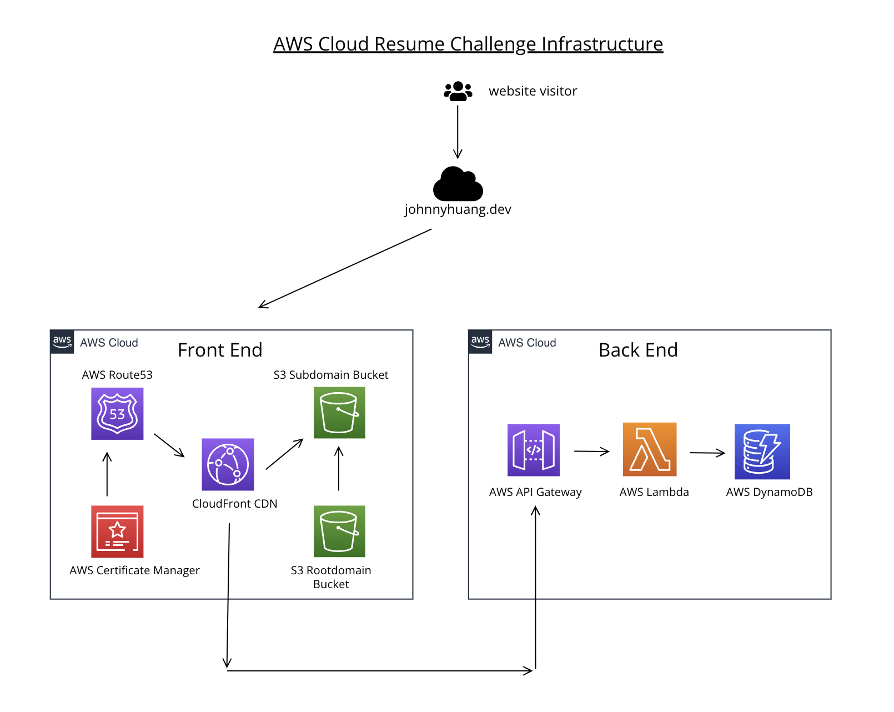

# Cloud Resume Challenge - Backend Repository

Welcome to the backend repository for my Cloud Resume Challenge! This repository contains all code and configurations necessary to power the backend services for my cloud resume website, including the visitor counter API and its supporting infrastructure.

Check out the frontend website: [www.johnnyhuang.dev](https://www.johnnyhuang.dev/)

Check out the blog: [Johnny's CRC Blog](https://leeward-fig-f44.notion.site/Johnny-s-CRC-Blog-11b96dded323802081bec3c41125e3c5)

Check out the frontend repository: https://github.com/JohnnyH-Dev/CRCFrontEnd

## Project Overview

This project is the backend component of my Cloud Resume Challenge. The backend consists of a visitor counter API that tracks and displays the number of visitors to my resume website. The following AWS services are used to power this backend architecture:

- **Amazon API Gateway**: 
  - Provides a secure and scalable entry point for HTTP requests from the frontend.
  - Configured with a REST API that triggers the Lambda function to update and retrieve the visitor count.

- **AWS Lambda**:
  - Runs serverless code to handle requests from API Gateway.
  - Updates and retrieves the visitor counter value stored in DynamoDB.
  - Written in Python, leveraging the boto3 library for AWS service interactions.

- **Amazon DynamoDB**:
  - Serves as a NoSQL database to store and persist the visitor counter.
  - Configured with on-demand capacity to minimize costs while supporting the simple, low-traffic workload.

- **AWS IAM**:
  - Manages access and permissions for the Lambda function, allowing it to read and write from DynamoDB.
  - Additional IAM roles and policies provide secure access between services.

## Technologies Used

- **Python**: For the Lambda function code, handling visitor count updates and retrieval.
- **DynamoDB**: Provides persistent storage for the visitor counter.
- **API Gateway**: Allows secure HTTP requests from the frontend to the backend.
- **Terraform**: Manages the backend infrastructure as code, provisioning AWS resources such as Lambda, DynamoDB, and API Gateway.
- **GitHub Actions**: Automates testing and deployment workflows, ensuring smooth integration and delivery of backend updates.

## Features

- **Visitor Counter API**: Increments and retrieves the visitor count on each request from the frontend.
- **Serverless Architecture**: Leverages AWS Lambda and API Gateway to minimize infrastructure management.
- **Persistent Storage**: Uses DynamoDB to keep track of the visitor count across sessions.
- **IAM Roles and Policies**: Implements secure access control for AWS resources, limiting permissions to only what's necessary.

## File Structure

- `/terraform`: Contains Terraform configuration files for provisioning backend infrastructure.
- `terraform/lambda_function`: Contains the Python code for the Lambda function.
  - `lambda_function.py`: The main handler function, which updates and retrieves the visitor count.
- `README.md`: Project documentation and overview.